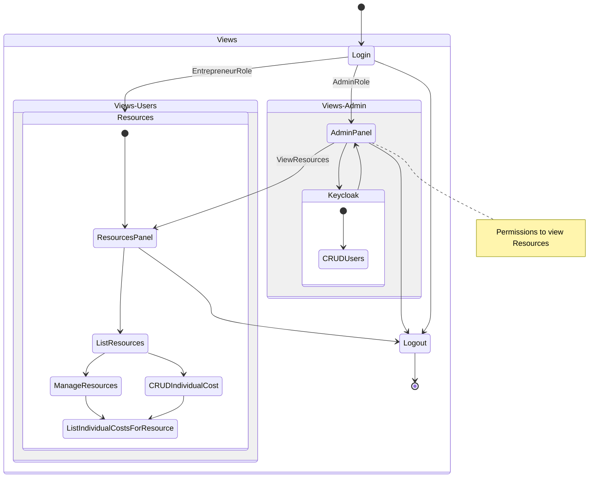
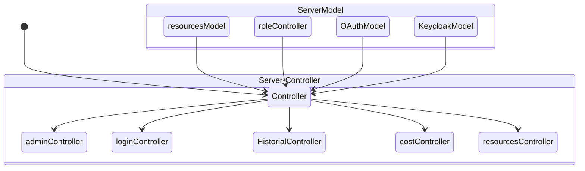

# MVC - State diagrams

## Views

```mermaid
stateDiagram-v2
    [*] --> Login
    state Views {
        state Views-Users {
            Login --> Resources : EntrepreneurRole
            state Resources {
                [*] --> ResourcesPanel
                AdminPanel --> ResourcesPanel : ViewResources
				ResourcesPanel --> ListResources
                ListResources --> ManageResources
                ListResources --> CRUDIndividualCost
                ManageResources --> ListIndividualCostsForResource
                CRUDIndividualCost --> ListIndividualCostsForResource
                ResourcesPanel --> Logout
            }
        }
        state Views-Admin {
            Login --> AdminPanel : AdminRole
            Keycloak --> AdminPanel
            AdminPanel --> Keycloak
            note right of AdminPanel
                Permissions to view Resources
            end note
            AdminPanel --> Logout
            state Keycloak{
                [*] --> CRUDUsers
            }
        }
        Login --> Logout
        Logout --> [*]
    }
```

## Controller - Model

```mermaid
stateDiagram-v2
[*] --> Controller
state Server-Controller {
    Controller --> adminController
    Controller --> loginController
    Controller --> HistorialController
    Controller --> costController
    Controller --> resourcesController
    resourcesModel --> Controller
    roleController --> Controller
    OAuthModel --> Controller
    KeycloakModel --> Controller
}
state ServerModel {
    resourcesModel
    roleController
    OAuthModel
    KeycloakModel
}


```

## MVC - PNG

