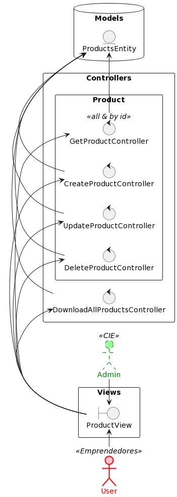
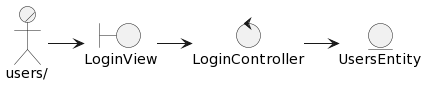
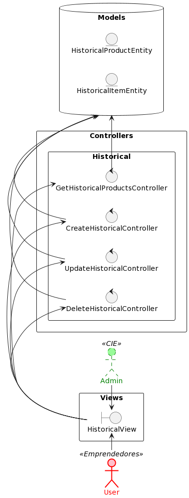
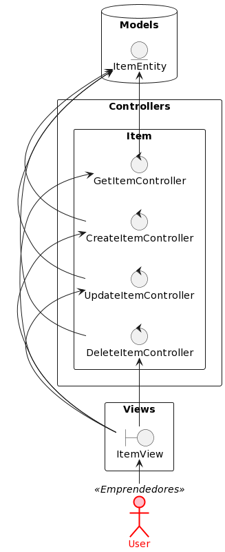
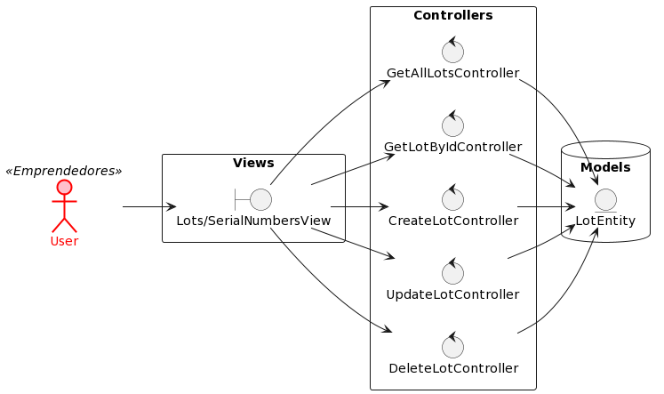

# Analysis

Cumplimiento de los analisis:

- Descrito en el lenguaje de los desarrolladores
- Vista interna del sistema
- Estructurado en Clases Estereotipadas y Paquetes; da estructura a la vista interna
- Usado principalmente por desarrolladores para comprender qué forma debería tener el sistema para el diseño e implementación
- No debería contener redundancias, inconsistencias, … entre las clases

- Describe cómo realizar la funcionalidad dentro del sistema, incluyendo la funcionalidad de importancia arquitectónica; funciona como un primer corte en el diseño
- Define la realización de casos de uso, donde cada uno representa el análisis de un caso de uso del modelo de casos de uso
- Modelo conceptual porque es una abstracción del sistema y evita cuestiones de implementación

- Diseño genérico (aplicable a varios diseños)
- Tres estereotipos conceptuales sobre las clases: modelo, vista y controlador
- Menos formal

- Menos caro de desarrollar (ratio de 1:5 respecto al diseño)
- Pocas capas

- Dinámico sin mucho enfoque en la secuencia
- Boceto del diseño del sistema, incluyendo su arquitectura
- Puede no ser mantenido durante todo el ciclo de vida del software
- Principalmente creado en "trabajo de campo", en talleres y similares

- Define unaestructuraque esunaentrada esencial, la forma del sistema–incluyendola creacióndel modelode diseño

## Products System

## Auth System

## Historical System

## Item System

## Lots And Serial Numbers

