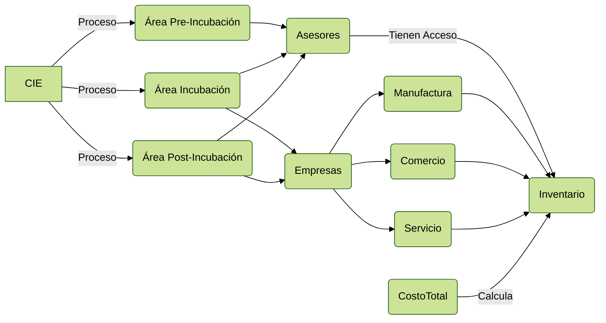
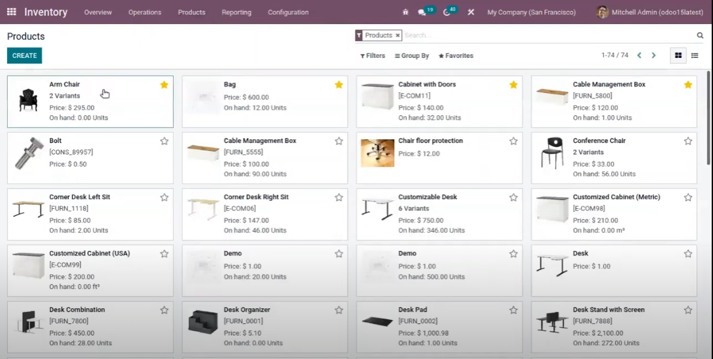
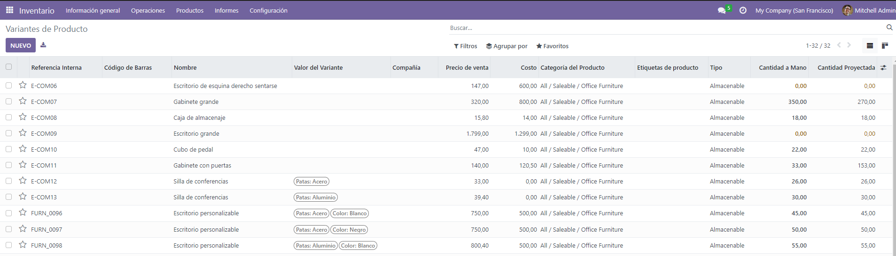
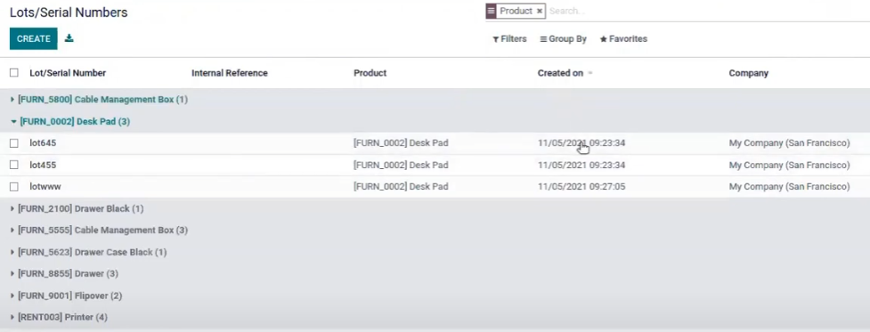
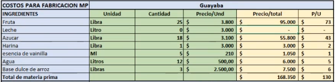
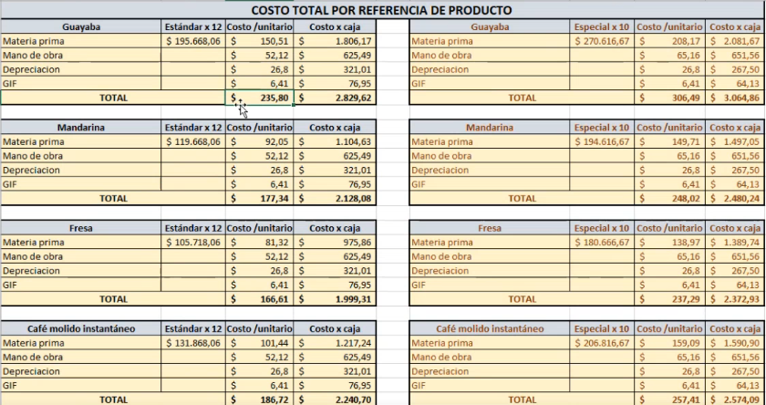

# Domain Model

Insumos, mano de obra, producto en procesos, servicios.

"*How is the system to be developed from the customer's point of view?*"

### Contexto:

> Anexo: [Excel (básico) de contexto del dominio](./assets/docs/Costos_Dulces.xlsx)

## Dominio centrado en Manufactura (Inventarios)

**Productos** (opciones seleccionables, ya que a un negocio no le van aplicar siempre los mismos campos):

- Producto
- Referencia Interna
- Responsable
- Etiquetas de producto
- Código de Barras
- Compañía
- Precio de venta
- Costo
- Categoría de Producto
- Tipo de producto
- Cantidad a mano
- Cantidad Proyectada

**Variante de Producto:**

- Referencia Interna
- Código de Barras
- Nombre
- Valor de Variante
- Compañía
- Precio de Venta
- Costo
- Categoría del Producto
- Etiquetas de Producto
- Tipo
- Cantidad a Mano
- Cantidad Proyectada

## Qué puede contener un Producto?:

Favorito, Nombre del producto, Puede ser vendido, puede ser comprado, imagen del producto.

**Información General del producto:** 

> Tipo de producto

**Tipo de producto:** Un producto ***almacenable*** es un producto para el que gestiona stock, *Los productos       almacenables son artículos físicos para los que se gestiona el nivel de inventario.*

Un tipo de producto ***consumible*** es un producto para el que no se gestiona las existencias, *Los consumibles son 	productos físicos para los que no maneja el inventario: siempre están disponibles.*

Un tipo de producto ***servicio*** es un producto no material.

> Posibles casillas necesarias para un producto

Precio de venta (*Precio al que se vende el producto a los clientes*)

Costo

Categoría del Producto (*Depende del emprendimiento, deben poder crear su propia categoría y apartir de la creación de la categoría ellos pueden filtrar*)

Referencia Interna: en la mayoría de casos son referencias que ellos mismos pueden construir.

Código de barras (si existe)

Etiquetas de producto

Notas Internas

### Atributos y Variantes:

Son opciones como atributos y variantes que ellos mismos pueden crear a partir de un producto que posiblemente puede contener el mismo costo, donde hay dos tipos de campos, **Atributo** y **Valores**

*Ejemplo de Atributos:*  Patas, Color, Duración

*Ejemplo de Valores:* Blanco y Negro 

### Cantidades:

Donde ellos pueden encontrar las cantidades correspondientes a un producto (*y a todas sus variantes de productos?*), además donde van a encontrar el historial de todas las cantidades por fecha

Producto

Categoría del Producto

Última fecha de Conteo

Cantidad disponible

Cantidad a Mano

Cantidad contada

Diferencia

Fecha Programada

Usuario

Funciones que se necesitan, crear un recurso, necesitan descargar todos los recursos, agrupar por, favoritos, filtros, paginaciones, métodos distintos de vistas

### Productos

### Variantes de Producto

### Lotes/Números Seriales (seriales de fabricación/producción)

## Dominio centrado en Manufactura (Costos)

Pymes - Emprendimientos - Emprendedores - Empresas pequeñas

- **Qué le sirve a una empresa que tenga funcionalidad el Sistema del CIE?:** saber cuánta materia prima (ej. guayaba - fruta) gasta, al final de saber cuánto de materia prima se gasta para la fabricación, se hace un **COSTOS PARA FABRICACIÓN MP** sobre ese producto, es decir, se saca el total de costos sobre el  producto usando variables como, ingredientes(nombres), unidad, cantidad, precio/und, precio/total, P/U

  

  Aparte de materia prima qué más se gasta en la fabricación de un producto?:

  | Gastos                                   | Descripción                                                  |
  | ---------------------------------------- | ------------------------------------------------------------ |
  | Mano de Obra                             | Cuántas horas le dedica al embalaje etc...                   |
  | Servicios                                | Agua, Luz etc..                                              |
  | Gastos Generales (Otros tipos de Gastos) | Productos de Aseo, Impuesto predial, Cámara de comercio, Herramientas, Tazas y Otros, Fletes, Combustible leña, papel plástico enfriamiento etc... |
  | Numero de trabajadores                   | Dos personas que le paga el salario minimo                   |

  Luego de hacer eso, los del CIE empiezan a calcular cuánto sale en materia prima para cada uno de los *sabores* entonces empiezan a dividir, "suma todo eso, dividen todo eso" y le digo en cuánto deben depreciar los productos y al final sale total costo de "dulces"

  

