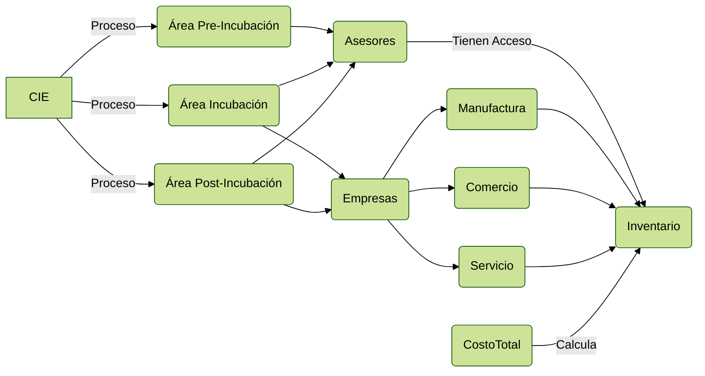

# Domain

"*How is the system to be developed from the customer's point of view?*"

```mermaid
%%{init: {'theme':'forest'}}%%
graph LR
A[CIE] -->|Proceso| B(Área Pre-Incubación)
A[CIE] -->|Proceso| C(Área Incubación)
A[CIE] -->|Proceso| D(Área Post-Incubación)
B --> E(Asesores)
C --> E(Asesores)
D --> E(Asesores) -->|Tienen Acceso| J(Inventario)
F(Empresas) --> G(Manufactura) --> J(Inventario)
C --> F(Empresas) --> H(Comercio) --> J(Inventario)
D --> F(Empresas) --> I(Servicio) --> J(Inventario)
K(CostoTotal) -->|Calcula| J(Inventario)
```

## Domain as software development

DB

