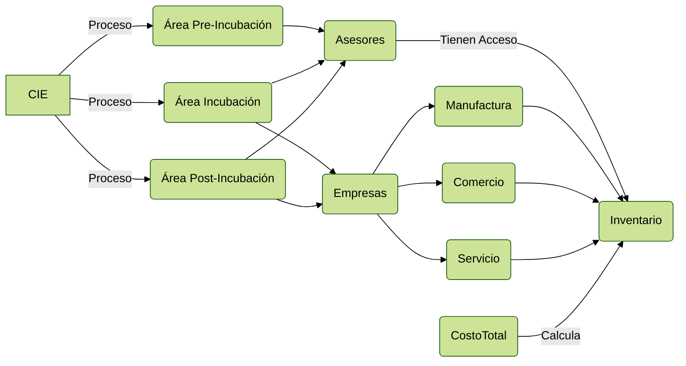
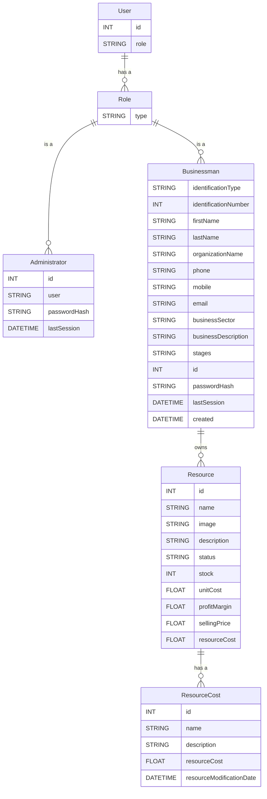
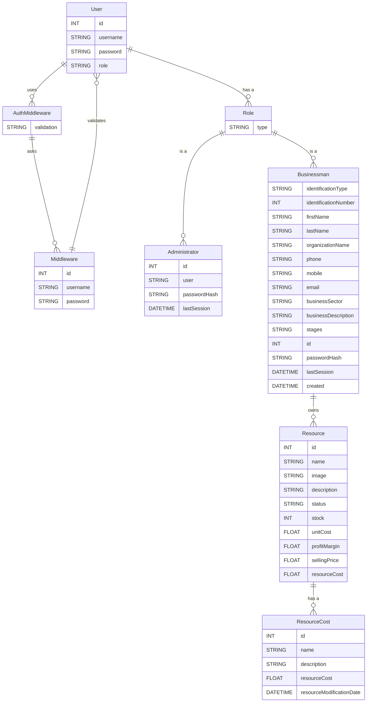

# Domain

"*How is the system to be developed from the customer's point of view?*"

```mermaid
%%{init: {'theme':'forest'}}%%
graph LR
A[CIE] -->|Proceso| B(Área Pre-Incubación)
A[CIE] -->|Proceso| C(Área Incubación)
A[CIE] -->|Proceso| D(Área Post-Incubación)
B --> E(Asesores)
C --> E(Asesores)
D --> E(Asesores) -->|Tienen Acceso| J(Inventario)
F(Empresas) --> G(Manufactura) --> J(Inventario)
C --> F(Empresas) --> H(Comercio) --> J(Inventario)
D --> F(Empresas) --> I(Servicio) --> J(Inventario)
K(CostoTotal) -->|Calcula| J(Inventario)
```

## Domain as software development

```mermaid
erDiagram
  User {
    INT id
    STRING role
  }
  Role {
    STRING type
  }
  Administrator {
    INT id
    STRING user
    STRING passwordHash
    DATETIME lastSession
  }
  Businessman {
    STRING identificationType
    INT identificationNumber
    STRING firstName
    STRING lastName
    STRING organizationName
    STRING phone
    STRING mobile
    STRING email
    STRING businessSector
    STRING businessDescription
    STRING stages
    INT id
    STRING passwordHash
    DATETIME lastSession
    DATETIME created
  }
  Resource {
    INT id
    STRING name
    STRING image
    STRING description
    STRING status
    INT stock
    FLOAT unitCost
    FLOAT profitMargin
    FLOAT sellingPrice
    FLOAT resourceCost
  }
  ResourceCost {
    INT id
    STRING name
    STRING description
    FLOAT resourceCost
    DATETIME resourceModificationDate
  }
  User ||--o{ Role : "has a"
  Role ||--o{ Administrator : "is a"
  Role ||--o{ Businessman : "is a"
  Businessman ||--o{ Resource : "owns"
  Resource ||--o{ ResourceCost : "has a"
```

## Domain as software development (With Middleware)

```mermaid
erDiagram
  User {
    INT id
    STRING username
    STRING password
    STRING role
  }
  AuthMiddleware {
    STRING validation
  }
  Middleware {
    INT id
    STRING username
    STRING password
  }
  Role {
    STRING type
  }
  Administrator {
    INT id
    STRING user
    STRING passwordHash
    DATETIME lastSession
  }
  Businessman {
    STRING identificationType
    INT identificationNumber
    STRING firstName
    STRING lastName
    STRING organizationName
    STRING phone
    STRING mobile
    STRING email
    STRING businessSector
    STRING businessDescription
    STRING stages
    INT id
    STRING passwordHash
    DATETIME lastSession
    DATETIME created
  }
  Resource {
    INT id
    STRING name
    STRING image
    STRING description
    STRING status
    INT stock
    FLOAT unitCost
    FLOAT profitMargin
    FLOAT sellingPrice
    FLOAT resourceCost
  }
  ResourceCost {
    INT id
    STRING name
    STRING description
    FLOAT resourceCost
    DATETIME resourceModificationDate
  }
  User ||--o{ AuthMiddleware : "uses"
  AuthMiddleware ||--o{ Middleware : "asks"
  Middleware ||--o{ User : "validates"
  User ||--o{ Role : "has a"
  Role ||--o{ Administrator : "is a"
  Role ||--o{ Businessman : "is a"
  Businessman ||--o{ Resource : "owns"
  Resource ||--o{ ResourceCost : "has a"

```

