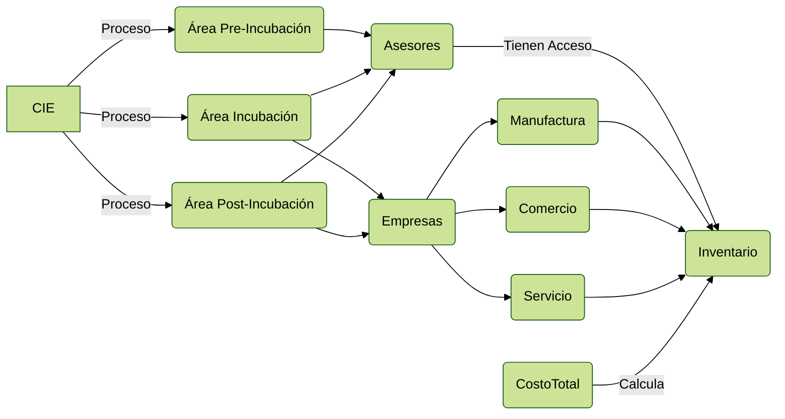

# Domain Model

# Planteamiento bajo los requerimientos previamente establecidos:

Dado que este a sido el primer feedback desde que se compartió la primera versión (borrador) del documento, se explica de forma abstracta todo el modelado del sistema actual y luego se plantean nuevos requerimientos y necesidades siguiendo el feedback compartido. Todo esto con contexto y vocabulario no técnico y dirigido hacía las posibles personas que tendrán un rol administrativo dentro del (`Sistema de Gestión de Recursos y Costos para emprendimientos del área de influencia de la UPB Bucaramanga`).

## Roles dentro del CIE 

"Emprendedor" y "Administrador" en el sistema representan diferentes tipos de **usuarios** con distintas funciones y responsabilidades

| Roles                           | Acciones / Actividades                                       |
| ------------------------------- | ------------------------------------------------------------ |
| Emprendedores                   | Estos emprendedores son todos aquellos que quieren ser parte o ya lo son del CIE. |
| Administrativos/Administradores | Los `administradores` son todos aquellos que tienen privilegios y permisos especiales dentro del sistema, Ejemplo: En un principió se planteó que debía existir alguien encargado del sistema, éste encargado claramente debe ser una persona asociada a todo el CIE. *Nota: en esta actividad del sistema falta establecer quienes son los que realmente van a administrar el sistema, es decir, quiénes pueden añadir usuarios, quiénes ver los activos de los usuarios ETC... ya que de momento se plantea como uno u múltiples usuarios administradores dentro del sistema con los mismos privilegios y roles como administradores*. |

## Registro | Inicio de Sesión | Autenticación

| Actividad            | Contexto                                                     |
| -------------------- | ------------------------------------------------------------ |
| **Registro**         | únicamente los administradores del Sistema (CIE) pueden registrar nuevos "usuarios" estos usuarios siendo con los roles Emprendedor y Administrador, es decir, un emprendedor no puede registrarse en el sistema de manera individual, debe ejercer la actividad de registro un administrador del CIE, esto con el fin de evitar que cualquier persona ajena al CIE se pueda registrar. |
| **Inicio de Sesión** | dado que es un Sistema Web que se puede ejecutar desde cualquier navegador con internet se debe utilizar este mismo para entrar a la web del Sistema, cualquier persona puede entrar a la página *(inicio de sesión o vista de bienvenida a la página)* pero no al sistema de gestión, solamente una persona autenticada y con rol puede iniciar sesión. *Ejemplo: página web con un inicio de sesión con usuario y contraseña, si son validos se redirigen exitosamente al sistema de gestión.* |

<u>Pregunta:</u> qué datos son los que se requieren para poder registrar un emprendedor y administrador dentro del sistema de gestión?, por decir, nombre, cédula, etc...

# Actividades por parte de los roles ya dentro del Sistema de Gestión dependiendo del tipo de rol

Una vez que un usuario es autenticado los va a redirigir al sistema de gestión dependiendo de su rol, antes de mostrar cada una de estas actividades se va a desglosar el planteamiento inicial del Sistema de Gestión en general: 

1. **Emprendedores**: Representa a las personas que inician un negocio.
2. **Emprendimiento**: Representa el proyecto o negocio iniciado por el emprendedor.
   - **Relación con Emprendedores**: Un emprendedor "tiene" uno o más emprendimientos.
3. **Recursos**: Representa los diferentes recursos que contiene un emprendimiento.
   - **Relación con Emprendimiento**: Un emprendimiento "contiene" uno o más recursos.
4. **Costos**: Representa los diferentes costos en los que incurre un recurso.
   - **Relación con Recursos**: Un recurso "incurre" en uno o más costos.
5. **Etiquetas**: Representa las diferentes etiquetas que pueden ser asignadas a un recurso.
6. **Recursos_Etiquetas**: Representa la relación entre recursos y etiquetas, es decir, qué etiquetas han sido asignadas a qué recursos.
   - **Relación con Recursos y Etiquetas**: Un recurso "es etiquetado" con una o más etiquetas y una etiqueta "etiqueta" a uno o más recursos.
7. **Historial_Costos**: Representa el historial de los diferentes costos registrados.
   - **Relación con Costos**: Un costo "registra" uno o más historiales de costos.

### Atributos de las Entidades:
- **Emprendedores**:
  - id: Identificador único del emprendedor.
  
- **Emprendimiento**:
  - uuid: Identificador único del emprendimiento.
  - nombre: Nombre del emprendimiento.
  - entidadOrgComunidad: Entidad organizadora o comunidad a la que pertenece el emprendimiento.
  - dirección: Dirección del emprendimiento.
  - CreateAT y UpdateAT: Fechas de creación y última actualización del emprendimiento.
  - imgURL: URL de la imagen del emprendimiento.
  - emprendedor_uuid: Identificador único del emprendedor relacionado.
  - sector: Sector al que pertenece el emprendimiento.
  - etapa: Etapa en la que se encuentra el emprendimiento. (Pre incubación - Incubación - Post Incubación)
  
- **Recursos**:
  - id: Identificador del recurso.
  - nombre: Nombre del recurso.
  - costoTotal: Costo total del recurso.
  - descripción: Descripción del recurso.
  - categoría: Categoría del recurso.
  - disponibilidad: Disponibilidad del recurso.
  - cantidad: Cantidad del recurso.
  - CreateAT y UpdateAT: Fechas de creación y última actualización del recurso.
  - imgURL: URL de la imagen del recurso.
  - emprendimiento_uuid: Identificador único del emprendimiento relacionado.
  
- **Etiquetas**:
  - id: Identificador de la etiqueta.
  - nombre: Nombre de la etiqueta.
  
- **Recursos_Etiquetas**:
  - recurso_id: Identificador del recurso relacionado.
  - etiqueta_id: Identificador de la etiqueta relacionada.
  
- **Costos**:
  - id: Identificador del costo.
  - nombre: Nombre del costo.
  - cantidad: Cantidad del costo.
  - unidadMedida: Unidad de medida del costo.
  - costoUnitario: Costo unitario.
  - costoTotal: Costo total.
  - tipoCosto: Tipo de costo.
  - CreateAT y UpdateAT: Fechas de creación y última actualización del costo.
  - detalle: Detalle del costo.
  - proveedor: Proveedor del costo.
  - recurso_id: Identificador del recurso relacionado.
  
- **Historial_Costos**:
  - id: Identificador del historial de costos.
  - fecha_registro y fecha_actualizacion: Fechas de registro y última actualización del historial de costos.
  - monto: Monto del historial de costos.
  - detalle: Detalle del historial de costos.
  - costo_id: Identificador del costo relacionado.

## Emprendedor

Dentro de la gestión de activos/recursos el rol **Emprendedor** va a tener distintas acciones disponibles como lo son:

| Actividad                          | Contexto                                                     |
| ---------------------------------- | ------------------------------------------------------------ |
| Crear un nuevo emprendimiento      | Un emprendedor puede crear su propio emprendimiento desde el sistema, dentro podrá crear cada uno de los campos que requiere el emprendimiento, como nombre, entidad organización o comunidad, dirección, una imagen representativa al emprendimiento, el sector en el que se encuentra el emprendimiento y la etapa. (Crear un nuevo emprendimiento, actualizar el emprendimiento, habilitar/deshabilitar, ver todos los emprendimientos) |
| Gestión del Activos / Recursos     | Dentro de este emprendimiento se pueden crear los activos como productos, servicios, manufactura etc, donde se puede generar las actividades/interacciones como: (Crear activo, Deshabilitar/habilitar activo, Eliminar activo, modificar activo, imagen del activo, ver el costo total de este activo), se puede ingresar a cada activo y listar los costos que luego se suman y hace parte al costo total de un activo. |
| Gestión de costos de cada activo   | Dentro de este activo se listan los costos y se puede (crear costo, deshabilitar costo, habilitar costo, eliminar costo, modificar costo, listar costo, ver costo total del activo, también opciones personalizables como añadir un proveedor, añadir detalles, tipo de costo (directo, indirecto...) unidades de medida, fechas de registro del costo |
| Filtrar activos                    | un emprendedor puede filtrar por activos de su emprendimiento, nombre, fechas, costo, stock |
| Buscar activos                     | un emprendedor puede buscar activos por el nombre (barra de búsqueda de los activos) |
| Histórico de costos de los activos | un emprendedor podrá ver el histórico del cambio de costo total de un activo, es decir, podrá ver una línea de tiempo referente a los costos establecidos bajo fecha que el emprendedor mismo podrá ingresar. |

## Administrativo | Administradores | Admin

| Actividad                                | Contexto                                                     |
| ---------------------------------------- | ------------------------------------------------------------ |
| Administrar usuarios                     | Crear usuarios con rol, eliminar usuario, habilitar/deshabilitar usuarios, editar usuarios, ver usuarios |
| Ver activos/recursos del rol Emprendedor | Un administrador puede ver todos los estados de la gestión de costos de los activos/recursos, ver sus costos, el rol administrador únicamente tendrá permisos de lectura, no podrá editar ni borrar nada de los emprendimientos del rol emprendedor. |

## Nuevos requerimientos / Necesidades vistos en el Feedback

- Productos de baja rotación.
- **Buen manejo** de sus materias primas, y cambiar **control de costos por costeo correcto**, establecer precios, tener un **buen manejo** de inventario y conocer su **punto de equilibrio**.
- Refiere a inventarios como **activos** de una empresa que consisten en bienes físicos, productos terminados, materias primas, componentes y suministros que están almacenados y disponibles para un proceso de producción o para su uso en la prestación de servicios