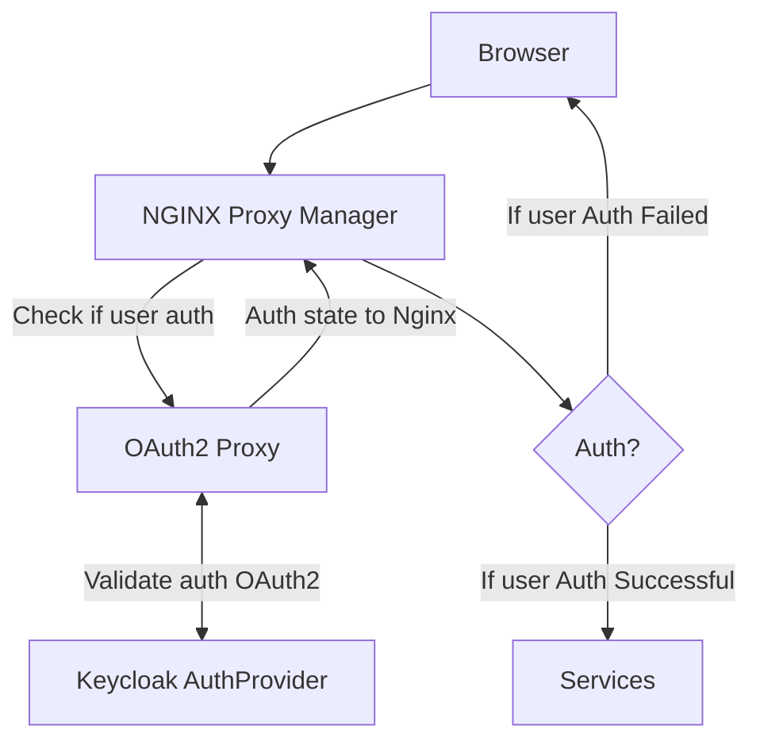

# Sequence diagrams Services Auth:  *Nginx - OAuth2 - Keycloak*

```mermaid
sequenceDiagram
	autonumber
	actor Client(Empresario/Admin)
	Client(Empresario/Admin)->>Browser : Using
	Browser->>(Nginx 443 Proxy Manager): Using
	(Nginx 443 Proxy Manager)->>OAuth2-Proxy : Check if user is Auth
	OAuth2-Proxy->>Keycloak: Validate User Auth Login
	Note over OAuth2-Proxy,Keycloak: OAuth2 req with auth provider
	Keycloak-->>Browser: redirect to /oauth2/callback
	Browser->>(Nginx 443 Proxy Manager): https req /oauth2/callback
	(Nginx 443 Proxy Manager)->>OAuth2-Proxy: https req /oauth2/callback
	OAuth2-Proxy->>Keycloak: Exchange code for access token
	Keycloak-->>OAuth2-Proxy: Send ID & Acces Token
	OAuth2-Proxy->>Browser: Send session cookie and redirect "/"
	Note over OAuth2-Proxy,Browser: IF user Auth SUCCESSFUL
	OAuth2-Proxy->>Browser: Redirect user to login portal
	Note over OAuth2-Proxy,Browser: IF user Auth FAILED
	(Nginx 443 Proxy Manager)->>OAuth2-Proxy: HTTP Req "/" Access services
	OAuth2-Proxy->>Services: HTTPS Req "/" Access services
	Note over (Nginx 443 Proxy Manager),Services: IF user Auth SUCCESSFUL
	Services-->>Browser: HTTPS Response
```

# Flowcharts - Services Auth:  *Nginx - OAuth2 - Keycloak*




## Services Admin

## Services Resources

## Services Client (NextJS)
